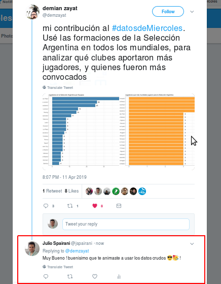
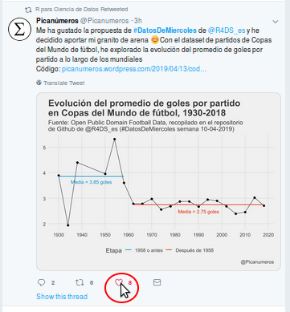
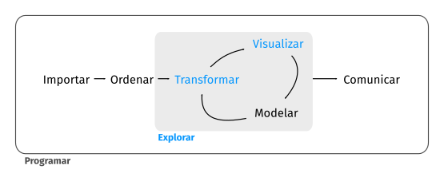
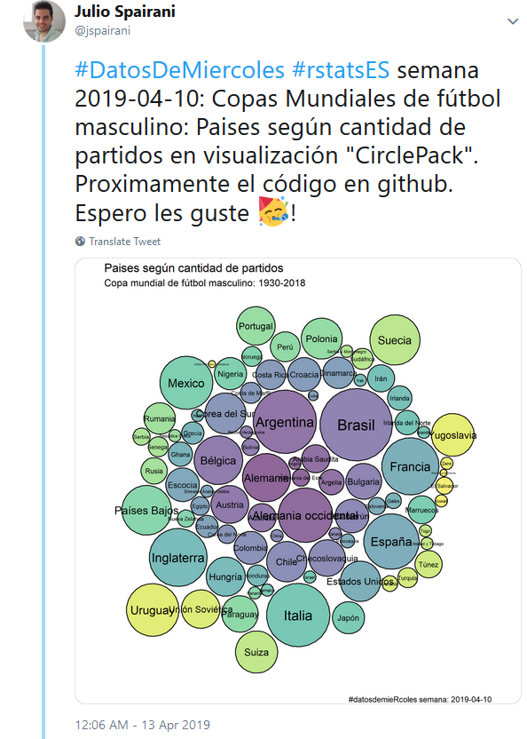

Quién alguna vez no se rompió la cabeza pensando como solucionar un problema de datos ?

???

SUPER MAGIA DE PRACTICA esto aparece en las notas del presentador que se activan con P


--


--


--


--


--


--

hasta ese momento que decis ...

---

class: inverse, center, middle

# QUE DATOS de MieR....coles !!!

## #DatosdeMiercoles #rstats

???

QUE DATOS DE MIERRRCOLES !

---

# Intro - que pasó ?

la mejor forma para que sea menor el dolor de cabeza es " la práctica ! "

???

SUPER MAGIA DE PRACTICA

--

- ya existen lugares donde se propone practicar, sea a traves de cursos o talleres, 

--

- esos tienen un fin y generalmente luego viene la parte dura, la práctica en la realidad.

--

- y justamente cuando te cae la práctica en la realidad, no todo esta tan " ordenado " como nos gustaría

--

- o no se nos ocurre que metodo aplicar a los datos nuevos que tenemos

--

- podemos saber un montón de herramientas y conocimientos, pero si no las usamos y cuidamos " se oxidan" 

---
# Intro - y ahora ?

- para solventar esto presentamos esta opción de práctica semanal en comunidad con diferentes datos todas las semanas. 

--

**práctica**: como mencione: con la práctica fortaleces lo que sabés y adquiris nuevos conocimientos.

--

**nuevos datos**: para que cuando nos toque " algo nuevo" por lo menos se nos ocurre que vimos algo tal vez similar.

--

**frecuencia semanal**: para mantenernos activos, si no se usa se oxida / hecha a perder.

--

**en comunidad**:

- para que sepamos que existen otras personas como nosotros que hacen algo similar, 

- para buscar apoyo / opiniones,

- para buscar inspiración / modelos a seguir,

- para saber que en comunidad se puede mas ! 

---
# Comunidad: Importante 

???

https://thewinnerinstituteblog.com/2016/10/18/dont-criticize-condemn-or-complain/

--

La idea no es criticar o destruir el trabajo de las personas de la comunidad de #rstatsES que participan. 


---
Sé amable y alienta el trabajo del resto. 



---
Dale un "like" a sus publicaciones y ayúdanos a promover la comunidad de R en español.



---
# contexto / historia: #TidyTuesday

esto ya existe en su versión en inglés y esta buenísimo ! #tidytuesday #rstats

https://twitter.com/

???

MOstrar la URL de twitter y mostrar como se busca el hashtag, y scrolear ... y contar lo siguiente 
luego de animarme a participar luego de varias semanas empece con ese sentimiento de 
" esto esta ... demasiado en inglés, y mi realidad es que yo trabajo con datos en español y ... 
seamos sinceros ... muchas de las cosas que en inglés funcionan, para español son un dolor de cabeza "

---
# algunos problemitas ... 

- tipos de archivos encodings: ASCII / UTF-8 / otros( ¿? ¡! á é í ó ú, Ñ , Ü )

- diccionarios para análisis de sentimientos, u otras prácticas.

- barrera de idiomática: buscas en español y no hay tantas respuestas como inglés o los resultados con menor calidad.

- para los que arrancan: poder darles ejemplos / datos nuevos que los entiendan sin tener que saber inglés, ya suficiente con que aprenden algo nuevo , ademaás en otro idioma :u ! 

---
# Todo muy lindo pero ... como hago para participar ?

--

## el modelo es el siguiente:

- Estar atentos los miercoles en @R4DS_es (https://twitter.com/R4DS_es) 
- te bajas los datos
- haces algo con ellos
- publicas lo que hiciste

---
# Publicación del desafío : 

cada semana: 

- se anuncia en: en el twitter de @R4DS_es (https://twitter.com/R4DS_es)

- se puede ver en el github: https://github.com/cienciadedatos/datos-de-miercoles

---
# conseguir los datos:

- ver el link semanal de twitter

- ver los datos en el github, 

- ejemplos de como bajarlos: https://github.com/cienciadedatos/datos-de-miercoles/tree/master/recursos

```{r eval=FALSE, tidy=FALSE}
# install.packages(readr)
conjunto_datos <- readr::read_delim("https://raw.githubusercontent.com/cienciadedatos/datos-de-miercoles/blob/master/datos/2019/2019-04-10/partidos.txt",delim = "\t")
```

---
# Hacer algo 

la idea seria practicar lo planteado en el libro R4DS, 

que da un "esquema de trabajo" recomendado para lo que es el mundo de los datos.

https://es.r4ds.hadley.nz/



- limpieza / transformación

- visualización 

- análisis

???
creditos: https://es.r4ds.hadley.nz/

---
# Algunos consejos -- contexto

Vas a tener dias inspirados y dias que no ... la vida es una montaña rusa de emociones, 


???
creditos: https://tammysdevoll.wordpress.com/2013/03/23/mood-swing-rollercoaster/

---

class: inverse, center, middle

### lo importante es tener 

# **constancia**

---

# Consejos

- Sea imitar, sea crear, sea innovar, sea agarrar un poquito de todos lados.

Si no estas inspirado fijate que hacen los demás, imitalos, acordate de citarlos tipo 

ejemplo: https://twitter.com/jspairani/status/1104616427095552000

???
"esta semana imite a juanito y le agregué un par de cosas"
Esto muestra que sabes hacer la cosa, y que la idea es de otro, y le das credito por ello. 
luego otros te citaran si gusta lo que haces =) .
Adaptarte a lo que puedas dar esa semana
		
---

# Publicar

Twitter, blog, git ( github / gitlab )

--

## Como veía mis objetivos ...

```{r  echo=FALSE,message=FALSE,warning=FALSE}

library(ggplot2)
library(ggrepel)
library(dplyr)
solia_pensar_df <- data.frame(desc=c('Idea',
  'Resultados Preliminares',
  'Mauscrito Borrador',
  'Mauscrito completo',
  'Paper publicado'),
  indice=c(1,2,3,4,5),
  y=c(0,0,0,0,0))

solia_pensar_df %>% 
    ggplot(aes(x=indice,
               y=y,label=desc))+
    geom_line()+
    geom_point(shape='|',size=5)+
    geom_label_repel(label.padding = 0.15,
                     nudge_y = c(0.01,-0.01,0.01,-0.01,0.01),
                     nudge_x = 0.1 )+
    annotate("text", x = 1, y = -0.015, label = "Menos\nValor")+
    annotate("text", x = 5, y = -0.015, label = "Mas\nValor")+
    expand_limits(y = c(-0.05, 0.05))+
    theme_minimal()+
    theme(axis.text.y = element_blank(),
          axis.text.x = element_blank(),
          panel.grid = element_blank(),
          plot.margin=grid::unit(c(0,0,0,0), "mm")) +
    labs(
        #title="Como veia mis objetivos",
         x='',
         y='')
# solia_pensar_df %>% 
# ggplot(aes(x=desc, y=c(0))) + geom_point()

```

---

# Como debería haberlos visto ... 

```{r  echo=FALSE,message=FALSE,warning=FALSE}

library(ggplot2)
library(ggrepel)
library(dplyr)
pienso_df <- data.frame(desc=c('','','','',
                              '','','',''),
  indice=c(1,1.2,1.3,1.4,
           5,5.2,5.3,5.4),
  y=c(0,0,0,0,
      0,0,0,0))

pienso_df %>% 
    ggplot(aes(x=indice,
               y=y,label=desc))+
    geom_line()+
    geom_point(shape='|',size=5)+
    # geom_label_repel(data,aes()
    #     label.padding = 0.15,
    #     nudge_y = c(0.01,-0.01,0.01,-0.01,0.01),
    #     nudge_x = 0.1 )+
    annotate("text", x = 1.2, y = 0.03, 
             label = "Cualquier cosa solo\nen tu computadora",
             fontface =2)+
    annotate("text", x = 5, y = 0.03, 
             label = "Cualquier cosa afuera\nen el mundo",
             fontface =2)+
    
    annotate("text", 
             x = 1.2, y = 0.012, 
             size=3,
             label = "(Datos, Codigo, resultados,\n borradores, paper terminados)")+
    annotate("text", 
             x = 5, y = 0.012, 
             size=3,
             label = "( Tweet, Opensource, Blog,\nProducto, Blog, Paper, resultados,\n borradores, paper terminados )")+
    
    annotate("text", x = 1, y = -0.015, label = "Menos\nValor")+
    annotate("text", x = 5, y = -0.015, label = "Mas\nValor")+
    expand_limits(y = c(-0.05, 0.05),
                  x = c(-0.1, 6))+
    
    theme_minimal()+
    theme(axis.text.y = element_blank(),
          axis.text.x = element_blank(),
          panel.grid = element_blank(),
          plot.margin=grid::unit(c(0,0,0,0), "mm")) +
    labs(
        #title="Como deberia haber pensado repsecto de ellos ...",
         x='',
         y='')
# solia_pensar_df %>% 
# ggplot(aes(x=desc, y=c(0))) + geom_point()

```


???

https://resources.rstudio.com/rstudio-conf-2019/the-unreasonable-effectiveness-of-public-work

hoy en día lo que hiciste va de la mano con que lo puedas demostrar 
tener un portfolio es importante, ahora ... como lo armas ? 
parece una decisión difícil , ahora ... si vas publicando de a poco , casi que se arma solo

si te haces visible, dejas a saber lo que podes hacer y que te interesa hacer.
es muy recomendado twitter, cuando te animes un blog, 
y si te interesa tener versiones de lo que haces un GIT.


	
	
---
	
# Publico todos los dias !  QUIERO MÁS ! 

podes ayudarnos proponiendo datasets e ideas a traves de nuestro repositorio: 

- https://github.com/cienciadedatos/datos-de-miercoles	

--

seguinos en twitter: 

- @R4DS_es asi te enteras de las novedades
- mira nuestro repo: https://github.com/cienciadedatos/datos-de-miercoles

--

???
mostrar el link y como se hace

por el momento nos organizamos en: 

- twitter: https://twitter.com/R4DS_es 
- github: https://github.com/cienciadedatos/datos-de-miercoles

---
class: inverse, center, middle

### a darle duro a esos 

# #DatosdeMiercoles #rstatsES

## Gracias !

@r4ds_es

@renbaires

@rladies
		